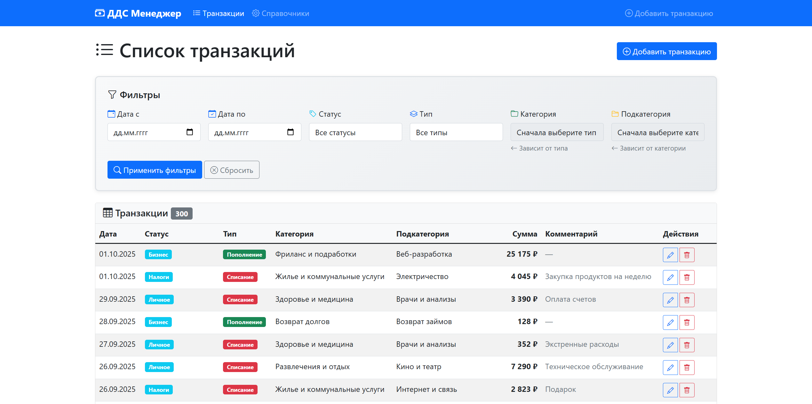
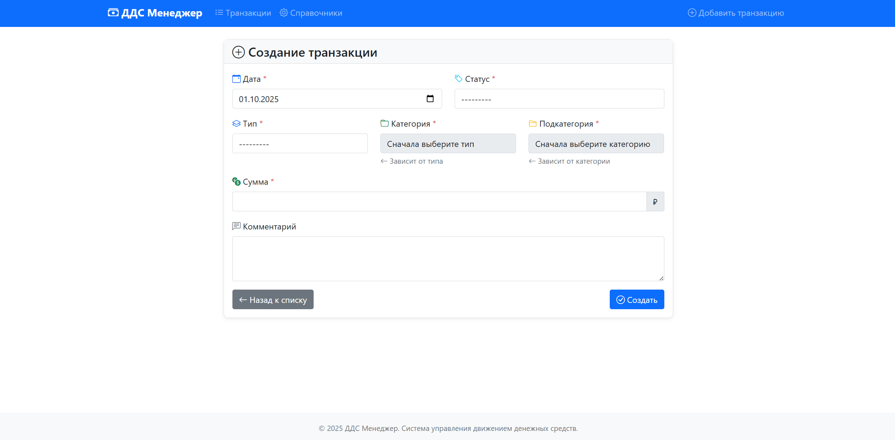
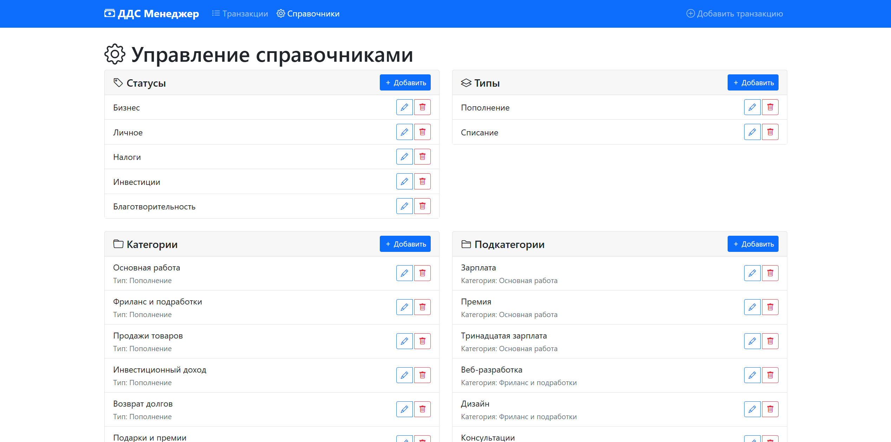
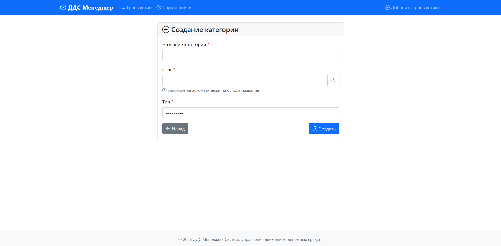

# ДДС Менеджер (Движение Денежных Средств)

Веб-приложение для управления личными и бизнес-финансами с возможностью учета доходов, расходов и детальной аналитики денежных операций.

## О проекте

Данный проект разработан в качестве тестового задания. Задача заключалась в создании веб-приложения для ведения учета движения денежных средств (ДДС) с поддержкой CRUD операций, фильтрации, валидации и иерархической системы категоризации транзакций.

### Основные возможности

- **Управление транзакциями**: создание, редактирование, удаление и просмотр записей о движении денежных средств
- **Гибкая категоризация**: иерархическая система типов, категорий и подкатегорий с настраиваемыми зависимостями
- **Расширяемые справочники**: возможность добавления собственных статусов, типов, категорий и подкатегорий
- **Мощная фильтрация**: поиск транзакций по дате (с указанием периода), статусу, типу, категории и подкатегории
- **Валидация данных**: проверка корректности связей между сущностями на уровне клиента и сервера
- **Адаптивный интерфейс**: дизайн на Bootstrap 5 с поддержкой мобильных устройств

### Технологический стек

- **Backend**: Python 3.13, Django 5.1.4
- **Database**: SQLite (по умолчанию)
- **Frontend**: HTML5, CSS3, Bootstrap 5.1.3, JavaScript (jQuery 3.6.0)
- **Testing**: Django TestCase
- **Validation**: Django Forms, Model validation

## Скриншоты интерфейса

### Главная страница со списком транзакций

*Таблица транзакций с возможностью фильтрации, редактирования и удаления*

### Создание новой транзакции

*Форма с динамическими полями и автоматической валидацией связей между категориями*

### Управление справочниками

*Централизованное управление всеми справочниками: статусами, типами, категориями и подкатегориями*

### Создание категории

*Форма создания категории с выбором типа и автоматической генерацией slug*

## Архитектура данных

Приложение использует следующую структуру данных:

```
Status (Статус) - независимая справочная таблица
Type (Тип) - независимая справочная таблица
    └── Category (Категория) - привязана к типу
        └── Subcategory (Подкатегория) - привязана к категории
            └── Transaction (Транзакция) - основная сущность
```

## Структура проекта

```
DDScoreTestTask/
├── dds_manager/              # Корневая директория Django проекта
│   ├── dds_manager/          # Пакет настроек проекта
│   │   ├── settings/
│   │   │   ├── __init__.py
│   │   │   ├── base.py       # Общие настройки для всех окружений
│   │   │   ├── dev.py        # Настройки для разработки
│   │   │   └── prod.py       # Настройки для production
│   │   ├── __init__.py
│   │   ├── urls.py           # Главный URL
│   │   ├── wsgi.py           # WSGI конфигурация
│   │   └── asgi.py           # ASGI конфигурация
│   ├── core/                 # Основное приложение
│   │   ├── management/
│   │   │   └── commands/
│   │   │       └── populate_database.py  # Команда заполнения БД
│   │   ├── migrations/       # Миграции базы данных
│   │   ├── templates/
│   │   │   ├── base.html     # Базовый шаблон
│   │   │   └── core/
│   │   │       ├── transaction_list.html
│   │   │       ├── transaction_form.html
│   │   │       ├── transaction_confirm_delete.html
│   │   │       ├── references_list.html
│   │   │       ├── reference_form.html
│   │   │       └── reference_confirm_delete.html
│   │   ├── __init__.py
│   │   ├── models.py         # Модели данных
│   │   ├── views.py          # Представления
│   │   ├── forms.py          # Формы
│   │   ├── urls.py           # URL-маршруты приложения
│   │   ├── admin.py          # Настройки админ-панели
│   │   ├── apps.py           # Конфигурация приложения
│   │   └── tests.py          # Unit-тесты
│   ├── .coveragerc           # Настройки coverage.py
│   ├── manage.py             # Утилита управления Django
│   └── db.sqlite3            # База данных (создается автоматически)
├── .env                      # Переменные окружения (не в git)
├── .gitignore                # Игнорируемые файлы для git
├── requirements.txt          # Зависимости Python
└── README.md                 # Документация проекта
```

## Установка и запуск

### Клонирование репозитория

```bash
git clone https://github.com/Sogato/DDScoreTestTask.git
```

### Создание виртуального окружения

**Windows:**
```bash
python -m venv .venv
.venv\Scripts\activate
```

**Linux/macOS:**
```bash
python3 -m venv .venv
source .venv/bin/activate
```

### Установка зависимостей

```bash
pip install -r requirements.txt
```

### Настройка переменных окружения

Создайте файл `.env` в корне проекта:

```env
SECRET_KEY=your-secret-key-here
DEBUG=True
DATABASE_URL=sqlite:///db.sqlite3
```

Для генерации SECRET_KEY выполните в Python:

```python
from django.core.management.utils import get_random_secret_key
print(get_random_secret_key())
```

### Настройка базы данных

Перейдите в директорию проекта и выполните миграции:

```bash
cd dds_manager
python manage.py migrate
```

### Создание суперпользователя (опционально)

Для доступа к админ-панели Django:

```bash
python manage.py createsuperuser
```

Следуйте инструкциям на экране для создания учетной записи администратора.

### Заполнение тестовыми данными

Для быстрого старта и тестирования функциональности используйте команду автозаполнения базы данных:

```bash
# Создать 200 транзакций (по умолчанию)
python manage.py populate_database

# Создать 500 транзакций
python manage.py populate_database --transactions 500

# Очистить существующие данные и создать новые
python manage.py populate_database --clear --transactions 300
```

Команда создаст:
- 5 статусов (Бизнес, Личное, Налоги, Инвестиции, Благотворительность)
- 2 типа операций (Пополнение, Списание)
- 12 категорий (6 для доходов, 6 для расходов)
- 36 подкатегорий (по 3 для каждой категории)
- Указанное количество транзакций с реалистичными данными за последний год

### Запуск сервера разработки

```bash
python manage.py runserver
```

Приложение будет доступно по адресу: [http://127.0.0.1:8000/](http://127.0.0.1:8000/)

Админ-панель Django: [http://127.0.0.1:8000/admin/](http://127.0.0.1:8000/admin/)

## Использование

### Основные страницы

**Главная страница** (`/`)
- Список всех транзакций в табличном виде
- Фильтры по дате (период "с" и "по"), статусу, типу, категории и подкатегории
- Кнопки для создания, редактирования и удаления транзакций
- Статистика по количеству пополнений и списаний

**Создание транзакции** (`/transaction/create/`)
- Форма для ввода данных новой транзакции
- Динамическая фильтрация категорий по выбранному типу (через AJAX)
- Динамическая фильтрация подкатегорий по выбранной категории (через AJAX)
- Валидация всех обязательных полей

**Редактирование транзакции** (`/transaction/<pk>/edit/`)
- Форма с предзаполненными данными существующей транзакции
- Возможность изменить любые поля
- Сохранение изменений с валидацией

**Удаление транзакции** (`/transaction/<pk>/delete/`)
- Страница подтверждения удаления с отображением информации о транзакции
- Предупреждение о необратимости действия

**Управление справочниками** (`/references/`)
- Просмотр всех статусов, типов, категорий и подкатегорий
- Создание, редактирование и удаление справочных данных
- Установление зависимостей между категориями и типами
- Защита от удаления справочников, используемых в транзакциях

### Работа с фильтрами

Система фильтрации позволяет быстро находить нужные транзакции:

1. **Фильтрация по дате**: укажите период "Дата с" и "Дата по" для отбора транзакций
2. **Фильтрация по статусу**: выберите конкретный статус из выпадающего списка
3. **Фильтрация по типу**: отфильтруйте пополнения или списания
4. **Фильтрация по категории**: выберите категорию (зависит от выбранного типа)
5. **Фильтрация по подкатегории**: выберите подкатегорию (зависит от выбранной категории)

Все фильтры можно комбинировать для получения точных результатов.

### Работа со справочниками

Справочники позволяют гибко настроить систему под ваши нужды:

1. Перейдите в раздел "Справочники" через навигационное меню
2. Выберите тип справочника (Статусы, Типы, Категории, Подкатегории)
3. Нажмите кнопку "Добавить" для создания новой записи
4. Заполните необходимые поля:
   - **Name (Название)**: название элемента справочника
   - **Slug (Слаг)**: автоматически генерируется из названия с транслитерацией
5. Для категорий обязательно выберите соответствующий тип
6. Для подкатегорий обязательно выберите соответствующую категорию
7. Нажмите кнопку "Создать" или "Сохранить"

**Внимание**: справочники, используемые в существующих транзакциях, защищены от удаления. При попытке удаления система выдаст предупреждение.

## Тестирование

### Запуск тестов

```bash
# Запуск всех тестов
python manage.py test

# Запуск тестов с подробным выводом
python manage.py test --verbosity=2

# Запуск конкретного класса тестов
python manage.py test core.tests.ModelsTestCase

# Запуск конкретного теста
python manage.py test core.tests.ModelsTestCase.test_transaction_creation_valid
```

### Покрытие кода тестами

Проект использует библиотеку `coverage` для анализа покрытия кода тестами:

```bash
# Запуск тестов с анализом покрытия
coverage run --source='.' manage.py test

# Просмотр отчета в терминале
coverage report
```

**Текущее покрытие кода: 62%**

Детальная статистика по модулям:
- `core/models.py`: 95% (основные модели данных)
- `core/views.py`: 88% (представления)
- `core/forms.py`: 83% (формы)
- `core/admin.py`: 66% (админ-панель)
- `core/urls.py`: 100% (маршрутизация)

**Примечание**: команда `populate_database.py` не покрыта тестами (0%), так как это вспомогательная утилита для генерации тестовых данных.

### Покрываемая функциональность

Набор тестов включает 59 тест-кейсов, проверяющих:

**Модели (ModelsTestCase)**
- Создание и валидацию всех моделей данных
- Корректность связей между моделями
- Уникальные ограничения
- Валидацию зависимостей (подкатегория → категория → тип)

**Формы (FormsTestCase)**
- Работу форм с валидными и невалидными данными
- Динамическую фильтрацию зависимых полей в формах
- Проверку обязательных полей
- Валидацию связей между сущностями

**Представления (ViewsTestCase)**
- CRUD операции через веб-интерфейс
- Фильтрацию транзакций
- Корректность отображения данных
- Редирект после успешных операций

**AJAX endpoints (AjaxViewsTestCase)**
- Загрузку категорий по типу
- Загрузку подкатегорий по категории
- Обработку некорректных параметров

**CRUD справочников (ReferenceCRUDTestCase, StatusCRUDTestCase, TypeCRUDTestCase, CategoryCRUDTestCase, SubcategoryCRUDTestCase)**
- Создание, редактирование, удаление справочников
- Защиту от удаления используемых справочников
- Работу с slug-полями

**Интеграционные тесты (IntegrationTestCase)**
- Полный цикл работы с транзакцией (создание → редактирование → удаление)
- Каскадную загрузку зависимых данных через AJAX

**Обработка ошибок (ErrorHandlingTestCase)**
- Корректную обработку 404 ошибок
- Валидацию при отсутствии обязательных параметров

## URL-маршруты приложения

### Основные страницы

| URL | Имя маршрута | Метод | Описание |
|-----|--------------|-------|----------|
| `/` | `transaction_list` | GET | Главная страница со списком транзакций и фильтрами |
| `/transaction/create/` | `transaction_create` | GET, POST | Создание новой транзакции |
| `/transaction/<int:pk>/edit/` | `transaction_update` | GET, POST | Редактирование транзакции |
| `/transaction/<int:pk>/delete/` | `transaction_delete` | GET, POST | Удаление транзакции |
| `/references/` | `references_list` | GET | Управление справочниками |

### Справочники - Статусы

| URL | Имя маршрута | Метод | Описание |
|-----|--------------|-------|----------|
| `/references/status/create/` | `status_create` | GET, POST | Создание статуса |
| `/references/status/<slug:slug>/edit/` | `status_update` | GET, POST | Редактирование статуса |
| `/references/status/<slug:slug>/delete/` | `status_delete` | GET, POST | Удаление статуса |

### Справочники - Типы

| URL | Имя маршрута | Метод | Описание |
|-----|--------------|-------|----------|
| `/references/type/create/` | `type_create` | GET, POST | Создание типа |
| `/references/type/<slug:slug>/edit/` | `type_update` | GET, POST | Редактирование типа |
| `/references/type/<slug:slug>/delete/` | `type_delete` | GET, POST | Удаление типа |

### Справочники - Категории

| URL | Имя маршрута | Метод | Описание |
|-----|--------------|-------|----------|
| `/references/category/create/` | `category_create` | GET, POST | Создание категории |
| `/references/category/<slug:slug>/edit/` | `category_update` | GET, POST | Редактирование категории |
| `/references/category/<slug:slug>/delete/` | `category_delete` | GET, POST | Удаление категории |

### Справочники - Подкатегории

| URL | Имя маршрута | Метод | Описание |
|-----|--------------|-------|----------|
| `/references/subcategory/create/` | `subcategory_create` | GET, POST | Создание подкатегории |
| `/references/subcategory/<slug:slug>/edit/` | `subcategory_update` | GET, POST | Редактирование подкатегории |
| `/references/subcategory/<slug:slug>/delete/` | `subcategory_delete` | GET, POST | Удаление подкатегории |

### AJAX Endpoints

| URL | Имя маршрута | Метод | Параметры | Описание |
|-----|--------------|-------|-----------|----------|
| `/ajax/load-categories/` | `ajax_load_categories` | GET | `type_id` | Возвращает список категорий для указанного типа в формате JSON |
| `/ajax/load-subcategories/` | `ajax_load_subcategories` | GET | `category_id` | Возвращает список подкатегорий для указанной категории в формате JSON |

**Формат ответа AJAX:**
```json
[
    {"id": 1, "name": "Название категории/подкатегории"},
    {"id": 2, "name": "Название категории/подкатегории"}
]
```

## Автор и ссылки

**Автор**: [Sogato](https://github.com/Sogato)  
**Репозиторий**: [github.com/Sogato/DDScoreTestTask](https://github.com/Sogato/DDScoreTestTask)  
**Год разработки**: 2025


